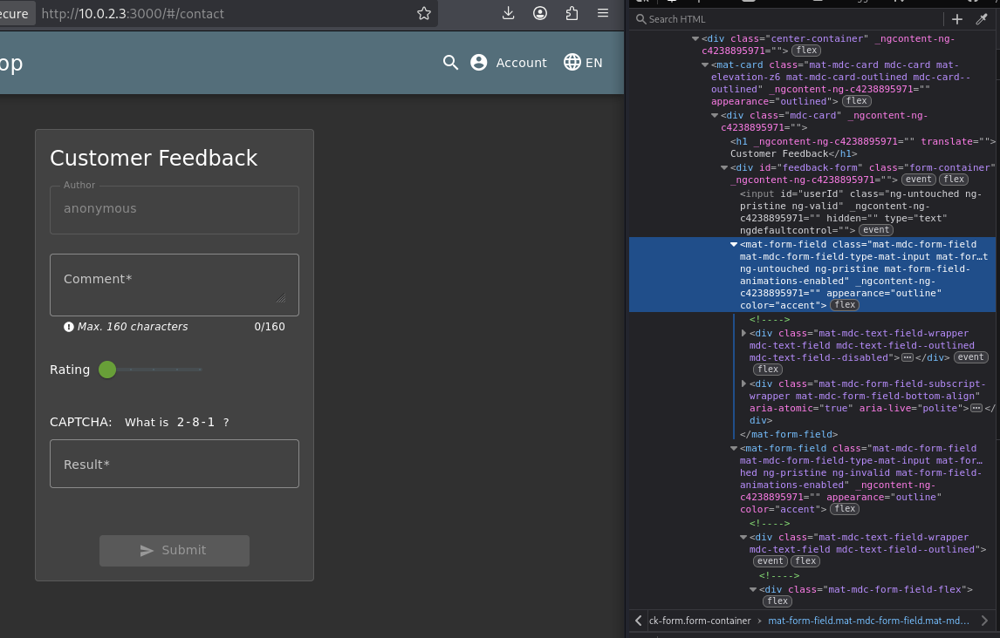
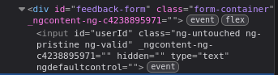
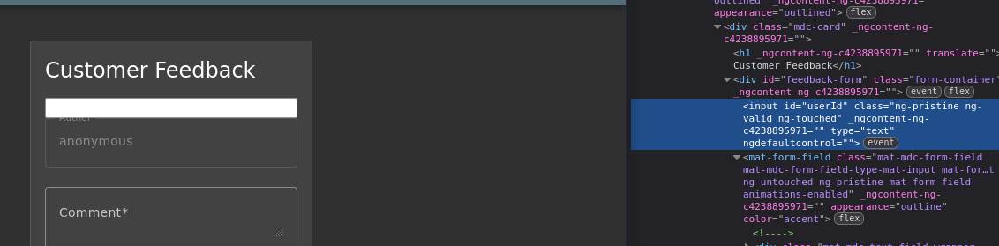
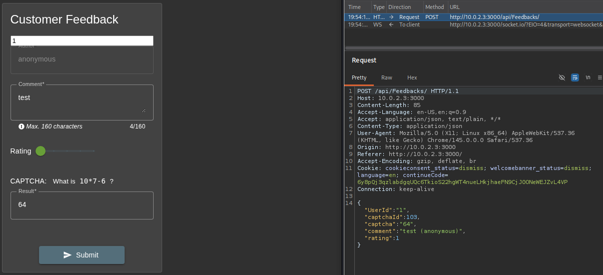
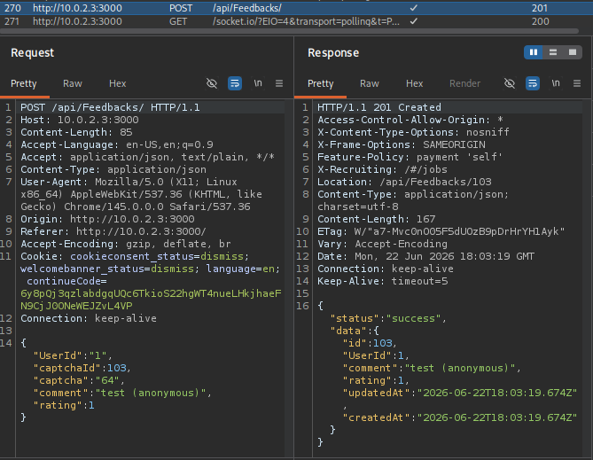

# Forged Feedback

**Category:** [Broken Access Control](https://pwning.owasp-juice.shop/companion-guide/latest/part2/broken-access-control.html)

## Description

The challenge is to post feedback in another user's name. This can be done without being logged in as any user.

## Exploitation

As the name of the challenge suggests, the feedback form is the first place to take a look at. When we inspect the input field for the author, we see something interesting:

There is an input field above the author field. It has `id="userId"` and is `hidden` via css.

When we remove the `hidden` attribute, we get to see (and use) the `userId` field.

We can just fill in the `userId` and the other required fields:

To our surprise, the backend accepts our forged data:

This solves the challenge `Post some feedback in another user’s name`